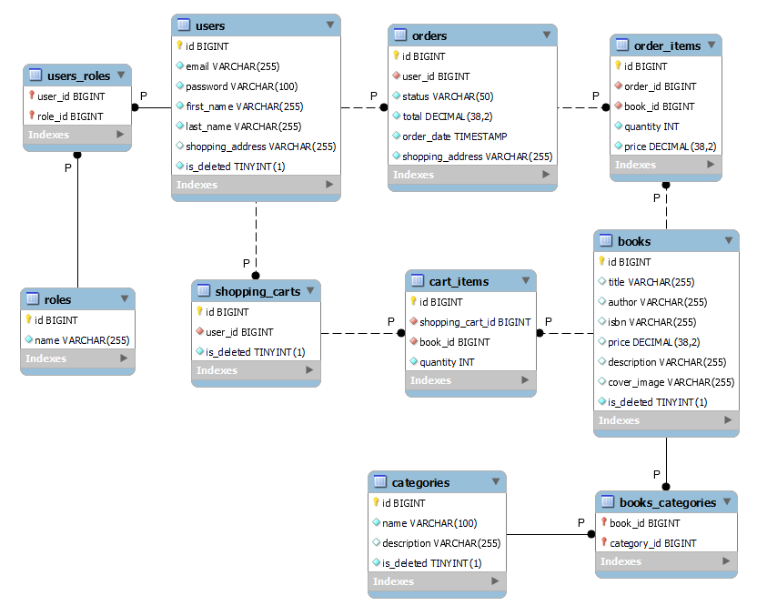

# Book Store API

## Introduction
Book Store API is a convenient and modern management system built using Spring Boot. This management system provides a wide range of interaction options for both the average users and the administrators. Great functionality, as well as ease of use, distinguishes this system among similar.

## Inspiration
The demand for online shopping is growing every day. People are accustomed to the fact that they can buy everything they need without leaving home, and this is especially applicable to such a product category as books. Therefore, literature stores need a powerful and reliable management system that will expand the market.

## Technologies Used
- **Java**: The programming language and platform for building and running the application.
- **Spring Boot**: A powerful framework for building Java-based enterprise applications.
- **Spring Security**: Ensures application security with features such as authentication and authorization.
- **Spring Data JPA**: Simplifies the data access layer, facilitating interactions with the database.
- **Swagger** (springdoc-openapi): Enables comprehensive API documentation, easing developer understanding and interaction.
- **Liquibase**: Manages database schema changes and version control.
- **MapStruct**: Simplifies the implementation of mappings between Java bean types.
- **JWT**: Ensures secure user authentication.
- **Docker**: Containerizes the application for consistent and portable deployment.
- **Lombok**: Reduces boilerplate code through annotations, enhancing developer productivity.
- **Hibernate**: A robust ORM framework that simplifies database interactions.
- **MySQL**: A reliable and scalable relational database management system.

## Key Features
- **JWT Token**: Used for secure user authentication and authorization, ensuring that user data is safely managed.
- **Swagger**: Provides comprehensive and interactive API documentation, making it easier for developers to understand and interact with the API endpoints.
- **Liquibase**: Facilitates smooth database schema updates and version control, ensuring consistent and reliable database management.

## Database Structure

## Project controllers

### Authentication Controller
Endpoints with open access for new users who want to register and for registered users who want to log in.

| HTTP method | Endpoint                      | Description                   |
|-------------|-------------------------------|-------------------------------|
| POST        | /authentication/registration  | Register a user               |
| POST        | /authentication/login         | Login a user                  |

### Books Management
Endpoints for mapping books.

| HTTP method | Endpoint          | Description                     |
|-------------|-------------------|---------------------------------|
| GET         | /books/{id}       | Get book by id                  |
| PUT         | /books/{id}       | Update book by id               |
| DELETE      | /books/{id}       | Delete book                     |
| GET         | /books            | Get all books                   |
| POST        | /books            | Create new book                 |
| GET         | /books/search     | Search books                    |

### Orders Management
Endpoints for mapping orders.

| HTTP method | Endpoint                             | Description                           |
|-------------|--------------------------------------|---------------------------------------|
| GET         | /orders                              | Returns all user's orders             |
| POST        | /orders                              | Create new order                      |
| PATCH       | /orders/{id}                         | Update status of order                |
| GET         | /orders/{orderId}/items/{itemId}     | Returns the order item                |
| GET         | /orders/{id}/items                   | Returns all items which contained in the order |

### Shopping Carts Management
Endpoints for mapping shopping carts.

| HTTP method | Endpoint                      | Description                |
|-------------|-------------------------------|----------------------------|
| PUT         | /cart/cart-items/{id}         | Update book quantity       |
| DELETE      | /cart/cart-items/{id}         | Delete cart item           |
| GET         | /cart                         | Get shopping cart          |
| POST        | /cart                         | Save cart item             |

### Categories Management
Endpoints for mapping categories.

| HTTP method | Endpoint              | Description                     |
|-------------|-----------------------|---------------------------------|
| GET         | /categories/{id}      | Get category by id              |
| PUT         | /categories/{id}      | Update category by id           |
| DELETE      | /categories/{id}      | Delete category                 |
| GET         | /categories           | Get all categories              |
| POST        | /categories           | Create new category             |
| GET         | /categories/{id}/books| Get books by category id        |

## Setup Instructions
To set up and run the project locally, follow these steps:

You can test and use this project:

1. Install [Docker](https://www.docker.com/products/docker-desktop/)

2. Clone this repository

3. Configure a ".env" file with necessary environment variables

4. Run the command `mvn clean package`

5. Use `docker-compose up --build` to build and launch Docker containers

6. Access the locally running application at [http://localhost:8090](http://localhost:8090)

## There are users to use

### Admin:
- **Email:** admin@gamil.com
- **Password:** adminpass
- **Authorities:**
  - ADMIN
  - USER

### User:
- **Email:** ivan@gmail.com
- **Password:** ivanpass
- **Authorities:**
  - USER

## Swagger API
For interactive API documentation, access the Swagger UI by navigating to [Swagger](http://localhost:8090/swagger-ui/index.html#/) after running the application.

## Postman Collection
For a quick start, use the provided [Postman collection](https://www.postman.com/supply-specialist-25907922/workspace/online-book-store/collection/33020565-5398d69a-2f2b-4911-bb49-611dd68f9155?action=share&creator=33020565) to test the API endpoints. Import the collection into Postman and follow the included documentation.

## Author
+ [Bakhmet Ivan](https://github.com/BakhmetIvan)